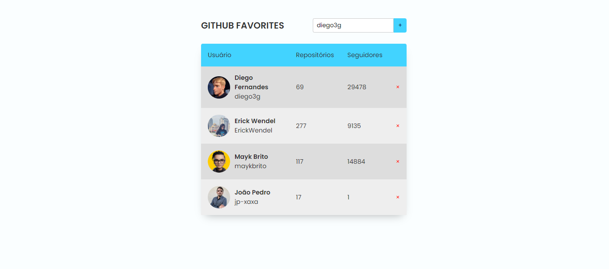

<h1 align="center">📝 GitHub Favorites! 📝</h1>

Criação de um site web onde conseguimos criar uma lista de usuários do GitHub a nossa escolha. Esse projeto foi desenvolvido no programa <a href="https://www.rocketseat.com.br/explorer">Explorer</a> da RocketSeat.

  <a href="#🚀-tecnologias">Tecnologias</a>&nbsp;&nbsp;&nbsp;|&nbsp;&nbsp;&nbsp;
  <a href="#💻-projeto">Projeto</a>

 

  

## 🚀 Tecnologias

Esse projeto foi desenvolvido com as seguintes tecnologias:

- Estrutura de dados HTML
- Funções no Javascript
- Funções Assíncronas Javascript
- Funções _callback_
- Higher-Ordem Functions
- Manipulação da DOM
- class
- Import e Export
- Local Storage
- Try e Catch
- Fetch

## 💻 Projeto

O site GitHub Favotires é um projeto que tem como objetivo ensinar os fundamentos essenciais do JavaScript com foco em funções, manipulação do DOM e Class para a criação da lógica da lista com todas as funcionalidades, como adicionar usuário com API, deletar usuário da lista e controles de erros possíveis. Além disso, concentramos nossos esforços em garantir que o código seja desenvolvido de maneira semanticamente correta e claro.

- [Acesse o projeto finalizado, online](https://jp-xaxa.github.io/gitfav/)
